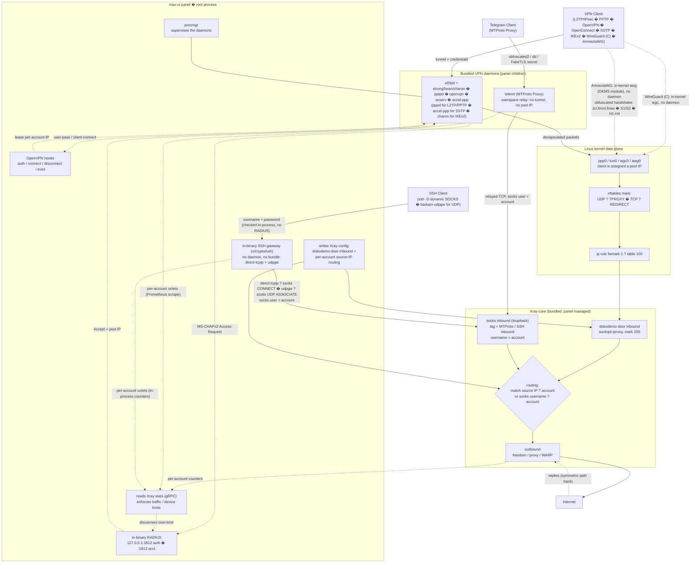
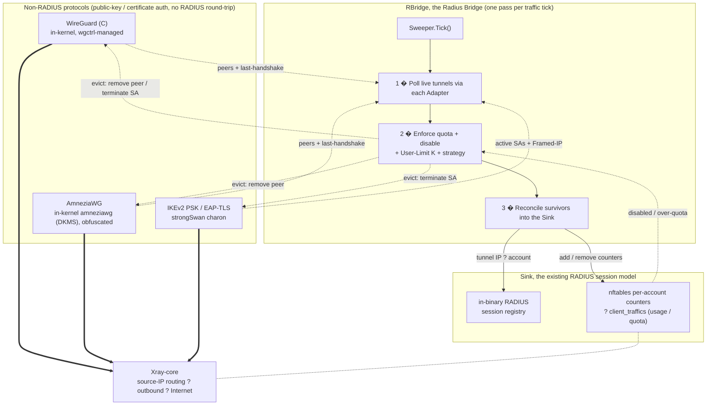

[English](/README.md) | [?????](/README_FA.md) | [???????](/README_AR.md) | [??](/README_ZH.md) | [Espa�ol](/README_ES.md) | [???????](/README_RU.md) | [T�rk�e](/README_TR.md)

<p align="center">
  
</p>

Bu proje, **[3X-UI](https://github.com/MHSanaei/3x-ui)** panelinin (2.9.3 s�r�m�) gelistirilmis bir versiyonudur. Projenin amaci; �esitli protokoller eklemek ve **Xray-core** �zelliklerini destekleyen kapsamli bir panel olarak hayata ge�irmektir.


## Yeni Protokoller

- PPTP
- L2TP (RAW)
- L2TP/IPsec
- OpenVPN
- OpenConnect (cisco)
- SSTP
- IKEv2
- WireGuard (C)
- AmneziaWG (gizlenmis WireGuard)
- MTProto Proxy (Telegram)
- SSH

## Yeni �zellikler

- Inbound bazli erisimle **�oklu Y�netici**: her y�netici yalnizca kendisine atadiginiz Inbound'lari g�r�r
- Y�neticinin y�kledigi �l��l� trafik bakiyesiyle **Bayi** hesaplari, yalnizca kendisine verilen Inbound'larda harcanir
- **Client to Client** �zelligi, hatta **Cross Inbound** bi�iminde bile (bir L2TP kullanicisinin bir OpenVPN kullanicisina dahili baglantisi)
- **Shadowsocks** protokol�ne **AES-256-GCM** ve **AES-128-GCM** **Encryption** y�ntemlerinin eklenmesi
- **Inbound** ve **Outbound** i�inde **XHTTP Object** destegi
- **[WARP-CLI](https://github.com/Sir-MmD/warp-cli)** (Cloudflare'in resmi s�r�m�) i�in otomatik kurulum betigi
- **Shadowsocks** protokol�ndeki �Unsupported Cipher� hatasini gidermek i�in [yamalanmis **Xray-core**](https://github.com/Sir-MmD/Xray-core) �ekirdegi
- T�m dosyalarin (Geofile, Xray-core ve Backend �ekirdekleri) tek bir binary dosyasi i�inde paketlenmesi
- Hesap baglantilarinin **TXT** ve **PDF** olarak disa aktarilmasi
- Hesaplari **dondurma (Freeze)** �zelligi
- Istemcilere ve Inbound'lara **checkbox** eklenmesi
- **Bulk Operation** �zelligi:
    * Hesaplarin trafigini toplu degistirme
    * Hesaplarin s�resini toplu degistirme
    * Hesaplari toplu etkinlestirme/devre disi birakma
    * Hesaplari toplu silme
    * Inbound'lari toplu silme
    * Hesaplari toplu **dondurma/��zme (Freeze/Un-Freeze)**

## Test Edilen Isletim Sistemleri


| | Dagitim |S�r�m |S�r�m |
|:---:|:---|:---:|:---:|
|  | **Ubuntu** | `24.04` | `26.04` |
|  | **Debian** | `12` | `13` |
|  | **Fedora** | `43` | `44` |
|  | **AlmaLinux** | `9` | `10` |
|  | **Rocky Linux** | `9` | `10` |
|  | **CentOS Stream** | `9` | `10` |
|  | **Arch Linux** | `Rolling` | |


> [!IMPORTANT]
> Paneli mutlaka test edilen isletim sistemlerine kurmaniz �nerilir; ��nk� yeni �ekirdeklerin diger isletim sistemlerinde d�zg�n �alismama ihtimali y�ksektir!

> [!NOTE]
> **AmneziaWG yalnizca Debian 12/13 ve Ubuntu 24.04/26.04 �zerinde �alisir.**
> Diger t�m protokollerin aksine AmneziaWG hi�bir dagitimin �ekirdeginde yer almaz: panel, kurulum sirasinda �ekirdek mod�l�n� sizin sunucunuzda derler. Bu mod�l su anda iki durumda derlenemiyor. **�ekirdek 7.1 ve �zerinde** (Fedora 43/44, Arch) �ekirdek, mod�l�n h�l� kullandigi `ipv6_stub` sembol�n� kaldirdi. **AlmaLinux, Rocky Linux ve CentOS Stream** �zerinde ise geriye uyarlanmis (backport) RHEL �ekirdekleri mod�l�n uyumluluk katmaniyla �akisiyor; EL10 ise bu katman tarafindan hi� taninmiyor. Her ikisi de AmneziaWG mod�l�n�n kendi sinirlamalaridir ve d�zeltmeleri ana projede h�l� beklemektedir, dolayisiyla panelin ayarlarla asabilecegi seyler degildir.
> Kurulum bunu tespit edip size bildirir, sessizce basarisiz olmaz. **Diger t�m protokoller, test edilen t�m isletim sistemlerinde normal sekilde �alisir.**

## Panel Kurulumu

```bash
curl -Ls https://raw.githubusercontent.com/PunisherCCC/Max-Ui/refs/heads/main/deploy.sh | sudo bash
```

## Panel Kaldirma

```bash
sudo /opt/max-ui/max-ui-amd64 --uninstall
```

> [!NOTE]
> Veritabani yolu, systemd servisi ve t�m varsayilan portlar degistirildi; bu y�zden bu paneli hi�bir sorun yasamadan diger panellerinizin yanina kurabilirsiniz.

## Yeni Protokollerin Xray-core �ekirdegi ile Etkilesimi



## RBridge, RADIUS Kullanmayan Protokolleri Nasil Entegre Eder

WireGuard (C), AmneziaWG ve IKEv2'nin **PSK** / **EAP-TLS** modlari a�ik anahtar veya sertifika ile kimlik dogrular; bu y�zden RADIUS ile gidis-gelis yapmazlar ve aksi h�lde ne oturum kaydi, ne trafik muhasebesi, ne de **User Limit** uygulamasi olurdu. **RBridge** (Radius Bridge) bu boslugu kapatir: her trafik d�ng�s�nde bir kez, **Sweeper** her protokol�n canli t�nellerini yoklar (poll), kotayi (quota), devre disi birakmayi ve hesap basina **User Limit** K'yi uygular (fazlaliklari evict ile atarak), ardindan hayatta kalanlari RADIUS protokollerinin zaten kullandigi ayni g�m�l� **RADIUS** oturum kayit defterine ve ayni **nftables** muhasebesine reconcile eder. B�ylece anahtar tabanli bir protokol kullanim, kota ve cihaz limiti a�isindan tipatip ayni davranir ve ayni Xray **dokodemo-door** veri d�zleminden internete �ikar.

Anahtar tabanli iki t�nel protokol�nde, **WireGuard (C)** ve **AmneziaWG**, K degerindeki bir **User Limit** her hesaba K adet cihaz yuvasi ayirir: K anahtar �ifti, K yapilandirma dosyasi ve K farkli t�nel IP'si, yani her cihaz i�in ayri bir yapilandirma. Bu, ticari saglayicilarin kullandigi modelin aynisidir ve tek bir hesabin telefonda, diz�st�nde ve router'da ayni anda, cihazlar tek bir anahtar i�in �ekismeden kullanilabilmesini saglar.



## Kaynaktan Derleme

```bash
git clone https://github.com/PunisherCCC/Max-Ui.git && cd max-ui
./build.sh
```

## E2E Testi


Bu proje i�in `test_unit` klas�r� i�inde Python ile tam bir **E2E** testi tasarlandi; bunu kullanabilirsiniz. Adimlari s�yledir:

1. `test_unit` klas�r�ne girin ve istediginiz ayarlari `config.toml` i�ine girin.
2. `setup.sh` betigini �alistirin.
3. Derlenmis binary dosyasini `test_subject` klas�r�n�n i�ine koyun.
4. `run.sh` betigini `sudo` yetkisiyle �alistirin.

> [!IMPORTANT]
> Tam E2E testi son derece zaman alicidir; eger projede yalnizca k���k bir degisiklik yaptiysaniz, `--tests` switch'i ile yalnizca o b�l�m� test etmeniz daha iyi olur:

| Test ID | Description |
| :--- | :--- |
| `core-init` | provision kernel modules + packages + xray core |
| `server-setup` | create inbounds + accounts + source-IP routing rules |
| `openvpn` | connect variants + checks + peer reachability (OpenVPN) |
| `l2tp` | connect variants + checks + peer reachability (L2TP/IPsec) |
| `pptp` | connect variants + checks + peer reachability (PPTP) |
| `openconnect` | connect variants + checks + peer reachability + same-NAT user-limit (OpenConnect/ocserv) |
| `sstp` | connect variants + checks + peer reachability (SSTP/accel-ppp, PPP-over-TLS) |
| `ikev2` | connect + checks + peer reachability (IKEv2/IPsec, strongSwan charon; eap-mschapv2 + psk + eap-tls) |
| `wg-c` | connect + checks + peer reachability + per-account usage/termination (WireGuard C, in-kernel wgctrl, gateway /29, + preshared-key mode) |
| `awg` | connect + checks + peer reachability + per-account usage/termination (AmneziaWG, in-kernel amneziawg DKMS module, obfuscation params, + preshared-key mode) |
| `mtproto` | alias: runs every MTProto phase below (MTProto Proxy, telemt) |
| `mtproto-classic` | handshake + relay to a real Telegram DC + wrong-secret control + usage (obfuscated2) |
| `mtproto-secure` | same, "dd" random-padding secret |
| `mtproto-tls` | same + FakeTLS ServerHello HMAC verified, "ee" secret |
| `mtproto-toggle` | editing an account's modes takes effect on the RUNNING daemon (no restart) |
| `mtproto-termination` | quota auto-disables the account AND the proxy stops relaying for it |
| `mtproto-adtag` | an ad tag forces middle-proxy egress and drops the inbound's Xray routing, and clearing it restores both |
| `ssh` | connect + checks + routing + user-limit + both strategies + per-account usage/termination (SSH relay, in-binary Go gateway) |
| `ssh-udp` | UDP through the relay: udpgw terminated in-process and bridged to Xray via SOCKS5 UDP ASSOCIATE, plus accounting |
| `bulk-ops` | bulk client add/sub/enable/disable + TXT/PDF export via API |
| `backup-restore` | DB export + import round-trip |
| `warp-socks` | Cloudflare warp-cli SOCKS install + egress |
| `random-cfg` | `--random` switch: randomize port + creds + webpath, then restore |
| `systemd` | `--systemd` switch: install + run the panel as a systemd unit |
| `uninstall` | `--uninstall` switch: install everything, tear down, assert clean host |
| `export-js` | host-side Node TXT/PDF export test (no VM) |

Yalnizca belirli bir isletim sisteminde test yapmak i�in de `--only` switch'ini kullanabilirsiniz:

```bash
sudo ./run.sh --only ubuntu-24
```

## Bagis

??USDC-Polygon: ```0xdC2Ab962954e8fA1502C44656c5A32CF2979568C```

??USDT-BEP20: ```0xdC2Ab962954e8fA1502C44656c5A32CF2979568C```

??USDT-TRC20: ```TXEhckDXtdLGAjP5PZXfNnQjPHzEVTcBmR```

??TRX: ```TXEhckDXtdLGAjP5PZXfNnQjPHzEVTcBmR```

??LTC: ```ltc1qmapmnuf6cq9x679nmu0k4uyq779mxxcwnkgdll```

??BTC: ```bc1q62w7lyndzndsp74vj4dsayvun8xnapzq6hx5ea```

??ETH: ```0xdC2Ab962954e8fA1502C44656c5A32CF2979568C```
